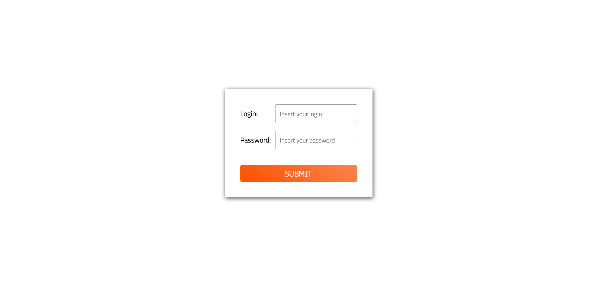

# Simple login form using Fetch into a JSON file

## Overview

### Screenshot

### Links

- Solution URL: Working on it.

## My process

### Built with

- Semantic HTML5 markup
- CSS custom properties
- Flexbox
- JavaScript

### What I learned

In this project i could use the fetch function to make a request to a JSON file, simulating a database, to verify the login and the password entered by the user.

So, the page can print alert messages according to the data entered.

The valid login and passwords are the following:

login: "maria", password: "4321"
login: "jorge", password: "1234"
login: "fernanda", password: "7412"
login: "otavio", password: "2147"

## Author

- GitHub - Vinícius dos Santos Verissimo (https://github.com/viniciusdsv93)
